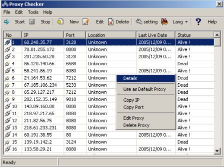

## a&lt;\-\- fast  Proxy Checker With English and  Farsi Language  \-\-&gt; Updated

### Description

This is Fast Proxy Checker . is Stor Proxy List In To A access file and can export and import list to a text file . its a multilanguage ( english an farsi ) application.

For Compelete Setup Download And Finding New Proxy List Goto :

http://exonsafety.com/soft/pirashky_en.htm
 
### More Info
 

             |
---                |---
**Submitted On**   |2005-12-21 11:39:08
**By**             |[ankabut](https://github.com/Planet-Source-Code/PSCIndex/blob/master/ByAuthor/ankabut.md)
**Level**          |Beginner
**User Rating**    |4.6 (23 globes from 5 users)
**Compatibility**  |VB 6\.0
**Category**       |[Complete Applications](https://github.com/Planet-Source-Code/PSCIndex/blob/master/ByCategory/complete-applications__1-27.md)
**World**          |[Visual Basic](https://github.com/Planet-Source-Code/PSCIndex/blob/master/ByWorld/visual-basic.md)
**Archive File**   |[a\_\-\-\_fast\_19588312222005\.zip](https://github.com/Planet-Source-Code/ankabut-a-lt-fast-proxy-checker-with-english-and-farsi-language-gt-updated__1-63583/archive/master.zip)

